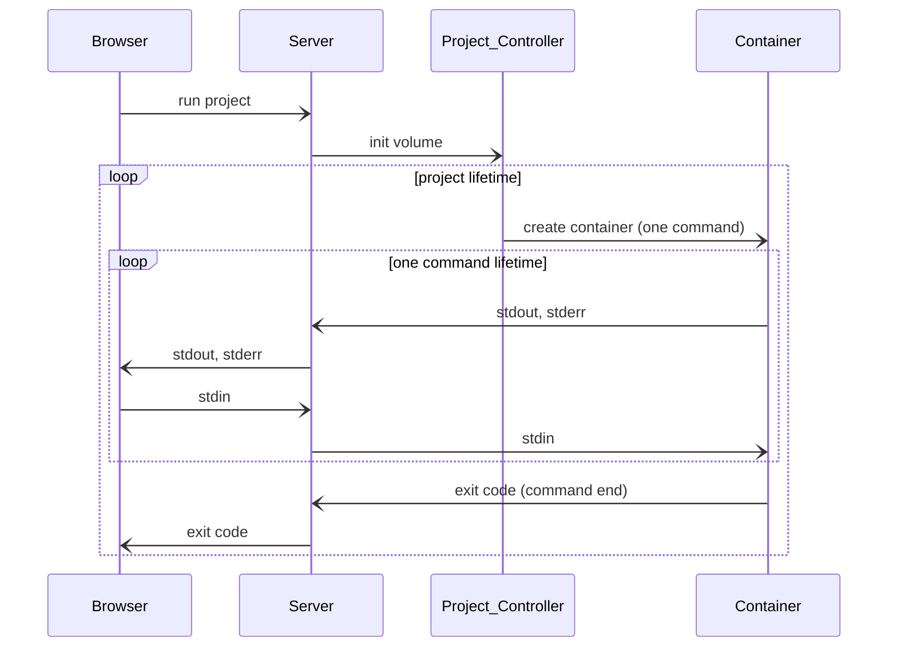

### Диаграмма последовательности выполнения проекта

```mermaid
sequenceDiagram
    participant Browser
    participant Server
    participant Project_Controller
    participant Container
    
    Browser-)Server: run project
    Server-)Project_Controller: init volume
    
    loop project lifetime
        Project_Controller-)Container: create container (one command)
        
        loop one command lifetime
            Container-)Server: stdout, stderr
            Server-)Browser: stdout, stderr
            Browser-)Server: stdin
            Server-)Container: stdin
        end
        Container-)Server: exit code (command end)
        Server-)Browser:  exit code
    end
```